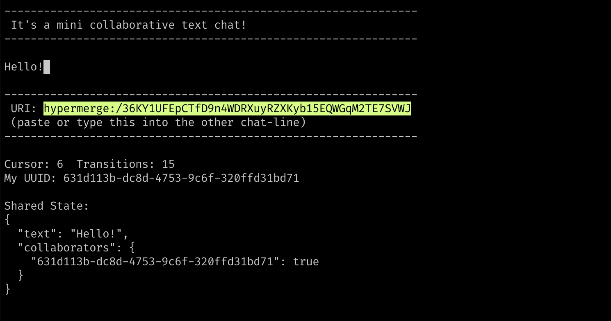
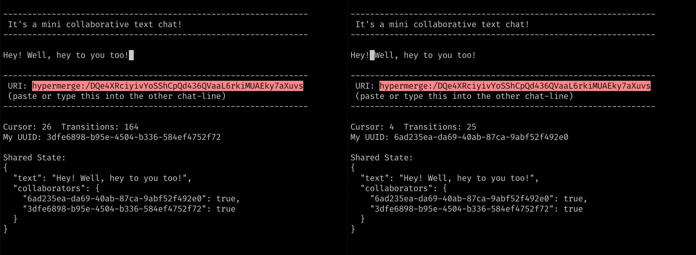

# Chat Line

A collaborative chat experience on the command-line.



Once both terminals have synced on the same Hypermerge URI, collaborative chat ensues:



## How to Run

Download & run:

```
yarn install
yarn start
```

## What is Hypermerge?

[Hypermerge]() is the networking layer between a text editor ([neat-input](https://github.com/mafintosh/neat-input) in this case) and [Automerge](https://github.com/automerge/automerge)]. It makes it easy to use [CRDTs](https://arxiv.org/abs/1608.03960) in an application.

## Thanks

Thanks to @pvh and others on the hypermerge/automerge team for help with issues & teaching me how this all works.

